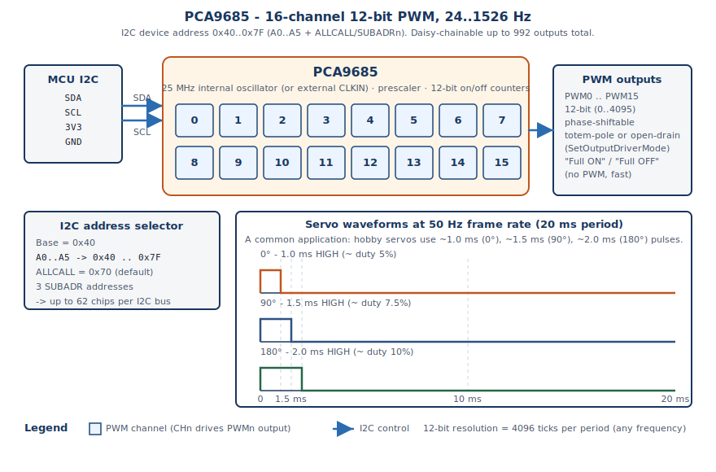

# HF-PCA9685 Driver
**Hardware-agnostic C++ driver for the NXP PCA9685 16-channel 12-bit PWM controller**

[](https://en.cppreference.com/w/cpp/11)
[](https://www.gnu.org/licenses/gpl-3.0)
[](https://github.com/N3b3x/hf-pca9685-driver/actions/workflows/esp32-examples-build-ci.yml)
[](https://n3b3x.github.io/hf-pca9685-driver/)

## 📚 Table of Contents
1. [Overview](#-overview)
2. [Features](#-features)
3. [Quick Start](#-quick-start)
4. [Installation](#-installation)
5. [API Reference](#-api-reference)
6. [Examples](#-examples)
7. [Documentation](#-documentation)
8. [References](#-references)
9. [Contributing](#-contributing)
10. [License](#-license)

## 📦 Overview

> **📖 [📚🌐 Live Complete Documentation](https://n3b3x.github.io/hf-pca9685-driver/)** -
> Interactive guides, examples, and step-by-step tutorials

The **PCA9685** is a 16-channel, 12-bit PWM controller from NXP Semiconductors that communicates via
I²C. It provides independent PWM control for up to 16 outputs with 12-bit resolution (4096 steps),
making it ideal for driving LEDs, servos, and other PWM-controlled devices. The chip features an
internal 25 MHz oscillator, configurable PWM frequency from 24 Hz to 1526 Hz, and supports
daisy-chaining multiple devices for up to 992 PWM outputs.

This driver provides a hardware-agnostic C++ interface that abstracts all register-level operations,
requiring only an implementation of the `I2cInterface` for your platform. The driver uses the CRTP
(Curiously Recurring Template Pattern) for zero-overhead hardware abstraction, making it suitable
for resource-constrained embedded systems.



## ✨ Features

- ✅ **16 Independent PWM Channels**: Each with 12-bit resolution (0-4095)
- ✅ **Configurable Frequency**: 24 Hz to 1526 Hz (typical range)
- ✅ **Hardware Agnostic**: CRTP-based I2C interface for platform independence
- ✅ **Modern C++**: C++11 compatible with template-based design
- ✅ **Zero Overhead**: CRTP design for compile-time polymorphism
- ✅ **Error Reporting**: Bitmask error flags (`uint16_t`) via `GetErrorFlags()` / `ClearErrorFlags()`
- ✅ **Duty Cycle Control**: High-level `SetDuty()` method for easy 0.0-1.0 control
- ✅ **Bulk Operations**: `SetAllPwm()` for simultaneous channel updates
- ✅ **Power Management**: `Sleep()` / `Wake()` via MODE1 SLEEP bit
- ✅ **Output Modes**: `SetOutputInvert()`, `SetOutputDriverMode()` (totem-pole/open-drain)
- ✅ **Full ON/OFF**: `SetChannelFullOn()` / `SetChannelFullOff()` without PWM
- ✅ **Retry Logic**: Configurable I2C retry count via `SetRetries()`

## 🚀 Quick Start

```cpp
#include "pca9685.hpp"

// 1. Implement the I2C interface (see platform_integration.md)
class MyI2c : public pca9685::I2cInterface<MyI2c> {
public:
    bool Write(uint8_t addr, uint8_t reg, const uint8_t *data, size_t len) noexcept;
    bool Read(uint8_t addr, uint8_t reg, uint8_t *data, size_t len) noexcept;
    bool EnsureInitialized() noexcept;
};

// 2. Create driver instance
MyI2c i2c;
pca9685::PCA9685<MyI2c> pwm(&i2c, 0x40); // 0x40 is default I2C address

// 3. Initialize and use
pwm.Reset();
pwm.SetPwmFreq(50.0f); // 50 Hz for servos
pwm.SetDuty(0, 0.075f); // Channel 0, 7.5% duty (1.5ms pulse for servo)
```

For detailed setup, see [Installation](docs/installation.md) and [Quick Start Guide](docs/quickstart.md).

## 🔧 Installation

1. **Clone or copy** the driver files into your project
2. **Implement the I2C interface** for your platform (see [Platform Integration](docs/platform_integration.md))
3. **Include the header** in your code:
   ```cpp
   #include "pca9685.hpp"
   ```
4. Compile with a **C++11** or newer compiler

For detailed installation instructions, see [docs/installation.md](docs/installation.md).

## 📖 API Reference

| Method | Description |
|--------|-------------|
| `Reset()` | Reset device to power-on default state |
| `SetPwmFreq(float freq_hz)` | Set PWM frequency (24-1526 Hz) |
| `SetPwm(uint8_t channel, uint16_t on, uint16_t off)` | Set PWM timing for a channel |
| `SetDuty(uint8_t channel, float duty)` | Set duty cycle (0.0-1.0) for a channel |
| `SetAllPwm(uint16_t on, uint16_t off)` | Set all channels simultaneously |
| `SetChannelFullOn(uint8_t channel)` | Set channel fully on (no PWM) |
| `SetChannelFullOff(uint8_t channel)` | Set channel fully off (no PWM) |
| `Sleep()` / `Wake()` | Power management via MODE1 SLEEP bit |
| `SetOutputInvert(bool invert)` | Set MODE2 INVRT bit |
| `SetOutputDriverMode(bool totem_pole)` | Set MODE2 OUTDRV bit (true=totem-pole, false=open-drain) |
| `SetRetries(int retries)` | Configure I2C retry count |
| `GetLastError()` | Get the last error code (convenience accessor) |
| `GetErrorFlags()` | Get all error flags as `uint16_t` bitmask |
| `ClearErrorFlags(uint16_t mask)` | Clear specific error flags |
| `GetPrescale(uint8_t &prescale)` | Get current prescale value |

For complete API documentation with source code links, see
[docs/api_reference.md](docs/api_reference.md).

## 📊 Examples

- **ESP32**: [examples/esp32](examples/esp32/) — two apps: **pca9685_comprehensive_test** (full driver
  test suite) and **pca9685_servo_demo** (16-channel hobby servo animations). See
  [examples/esp32/README.md](examples/esp32/README.md) for build/flash and
  [examples/esp32/docs/](examples/esp32/docs/) for per-app documentation.
- **Driver examples** (code snippets, any platform): [docs/examples.md](docs/examples.md).

## 📚 Documentation

For complete documentation, see the [docs directory](docs/index.md).

## 🔗 References

| Resource | Link |
|----------|------|
| NXP PCA9685 product page | <https://www.nxp.com/products/PCA9685> |
| PCA9685 datasheet (NXP) | <https://www.nxp.com/docs/en/data-sheet/PCA9685.pdf> |
| ESP-IDF I²C master | <https://docs.espressif.com/projects/esp-idf/en/stable/esp32/api-reference/peripherals/i2c.html> |
| Adafruit PCA9685 servo guide | <https://learn.adafruit.com/16-channel-pwm-servo-driver> |
| C++11 language reference | <https://en.cppreference.com/w/cpp/11> |

## 🤝 Contributing

Pull requests and suggestions are welcome! Please follow the existing code style and include tests for new features.

## 📄 License

This project is licensed under the **GNU General Public License v3.0**.
See the [LICENSE](LICENSE) file for details.

